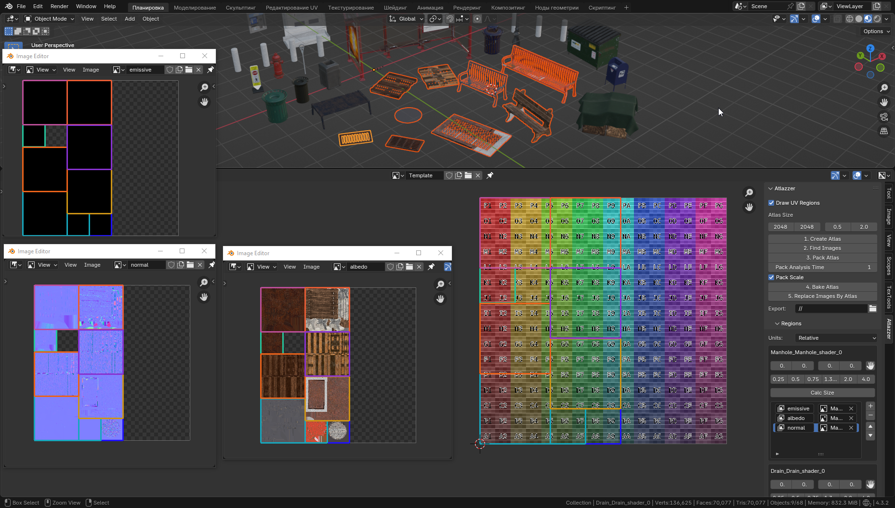

# Atlazzer

A collection of tools to work with atlases.
The addon allows you to transform, pack and sort islands, find texures and bake the atlas.

## Screenshots

## Installation

1. Download `.zip` archive
1. Open Blender
1. `Edit` -> `Preferences` -> `Add-ons` -> `Install from Disk`
1. Find and select archive
1. Make sure addon is enabled

## Guide

### After installation

Go to UV editor and open side panel (N).
Now you need to install libraries.
Click `Install Image Processing`.
Wait about 30 seconds.

### View UV regions

Select multiple objects and turn on `Draw UV Regions`.

If you don't see all regions, toggle this property. This happens when you select/deselect objects - this property doesn't updates automatically for performance reasons.

### Create atlas

Open UV editor and open side panel (N).

1. Select multiple objects you want to bake textures from
1. Specify atlas size
1. Click `Create Atlas` to create a template texture
1. Click `Find Images` to automatically search images and associate them with a region
1. Scroll to the `Regions` section
    1. Here you can manually add/remove textures from the list
    1. When you add a new one, there will be a string property. Set a value - it will be a name of the layer. Textures on the same layer will be rendered into the same atlas. Also atlas will be created with this name
    1. Set position and size of each region (in units `Units` -> `Relative` or in pixels `Units` -> `Pixels`). You can grab island by clicking the `hand` icon next to the scale options
1. Set attempting islands packing time by `Pack Analysis Time` and set `Pack Scale` to turn on/off scaling during packing operation. Then click `Pack Atlas`. Notice that you must be in `Object Mode` for this operation
1. Set `export` path
1. Click `Bake Atlas`
1. Next you may want to replace images with atlas to view the result, click `Replace Images by Atlas` for it
1. ...
1. Done! You can find images in the `export` path or next to the .blend file if you didn't specify a path. Also a few image editors will appear with atlases

# Community

Have a question, an idea or an issue? Or maybe you're looking for a team? Want to share your project? - Join our community!

Discord: [https://discord.gg/duDwM6PjGk](https://discord.gg/duDwM6PjGk)

## Special thanks

Huge thanks to the people who came up with the idea for this add-on and helped with the UX:

[ItShaman](https://vrchat.com/home/user/usr_8491a3f9-7921-4934-894e-18ec4e404a4d), [Fenrigore](https://vrchat.com/home/user/usr_92fefe81-8c8c-484d-9fdf-26c003a1630f)